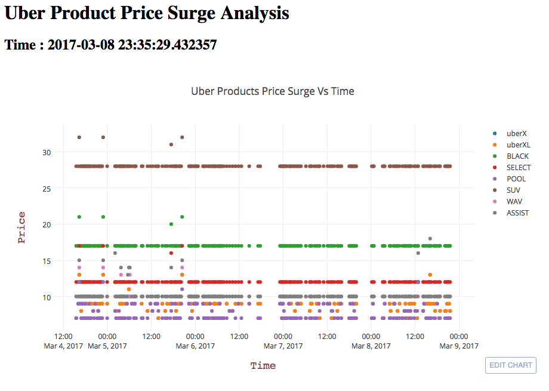

# Bay Area Uber Product Price Surge Analysis

## Project: GalvanizeU DSCI6007 Data Engineering

### Author: Srini Ananthakrishnan
### Date: 03/09/2017

### Introduction:
Project aims to monitor and map real-time Uber products price surge in San Francisco Bay Area. Twitter and Uber data information are clustered based on geolocations and mapped. Historical Uber pricing data will be analysed graphically.

### Data:

Project used two data sources.  

1) ** Twitter: ** Data (tweets) 50 miles around San Francisco area streamed with Geo-locations information  

2) ** Uber: ** Simultaneously for Geo-locations (latitude and longitude) obtained from tweets Uber pricing estimates are obtained.

### Architecture Diagram

### Ingestion Layer : 

AWS Kinesis Streams (configured on EC2) will be used to request data from Twitter and Uber firehose. Amazon provides a managed service built to make it easy to work with streaming data on AWS. It captures and stores streaming data reliably, and makes the data available in real time to stream processing applications

Kafka is considered for furture implementation. Kafka deployment on Amazon EC2 provides a high performance, scalable solution for ingesting streaming data  
Both data source are merged (json format) and stored on AWS S3 

### Transformation Layer:

Data stored on S3 will be further transformed using distributed computing (batch processing) SPARK running on EMR.   

Machine learning algorithm like KMeans Clustering are used to cluster Geo-location data based on latitudes and longitudes. Predicted culsters and transformed data are stored as tables in PostgressSQL database.

### Analysis Layer:  

Uber products like uberX, uberXL, etc., are analysed for price surge based on time and geo-locations. Running on separate EC2 instance. Analyzed data are graphically projected using plotly

### Presentation Layer:

Apache Flask framework is used to build the UI as it is light weight and easy to build.  Plotly plots are used to show the realtime location's where price surge is happenning. Plotly mapbox objects are used to project clustered data and price surge historical analysis.

### User Interface Snapshot

#### Plot showing Uber Products Price Surge Vs Time

#### Plot showing cluster wise uber products price surge

#### Map plot showing cluster centers of tweets and possibly price surge

### How to run this application ?

#### Install following modules

**Ingestion (EC2 running ubuntu): **  
- sudo pip install twitter pandas -U  
- sudo pip install uber_rides, pyspark  

**Transformation (Spark running on EMR):**  
- sudo apt-get install python-psycopg2  

**Analysis (EC2 running ubuntu):**  
- sudo apt-get install python-psycopg2  

**Presentation (EC2 running ubuntu):**  
- sudo pip install Flask  
- sudo apt-get install python-pandas python-yaml  

Note: All layers are running on independent AWS node(s)  
- sudo apt-get upgrade  
- sudo apt-get update

**Executing in following order:**  
- ingestion: sudo python data_ingestion.py &  
- transformation: spark-submit data_transformation.py  
- analysis: sudo python data_analysis.py &  
- presentation: sudo python run.py &

#### User Interface

[Bay Area Uber Product Price Sugre Analysis](http://ec2-107-23-0-110.compute-1.amazonaws.com:5000/)

